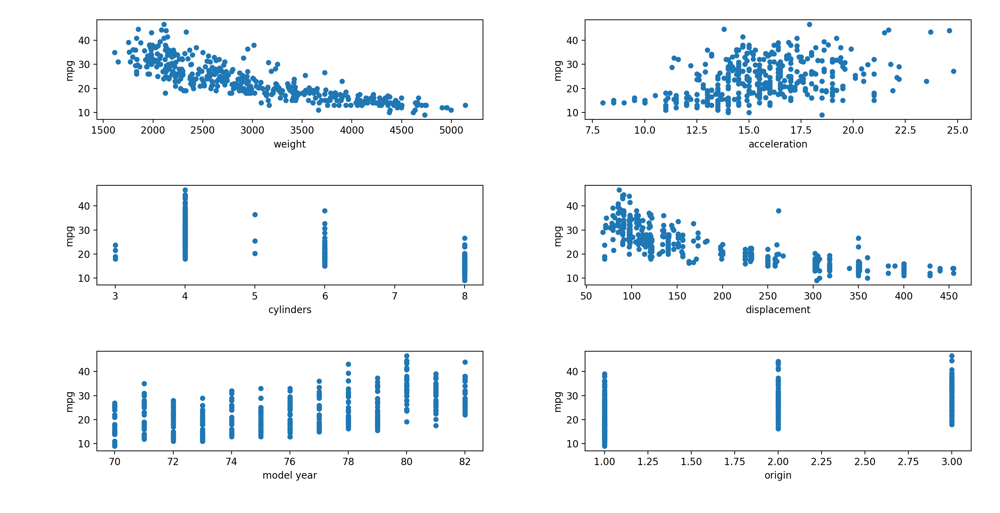
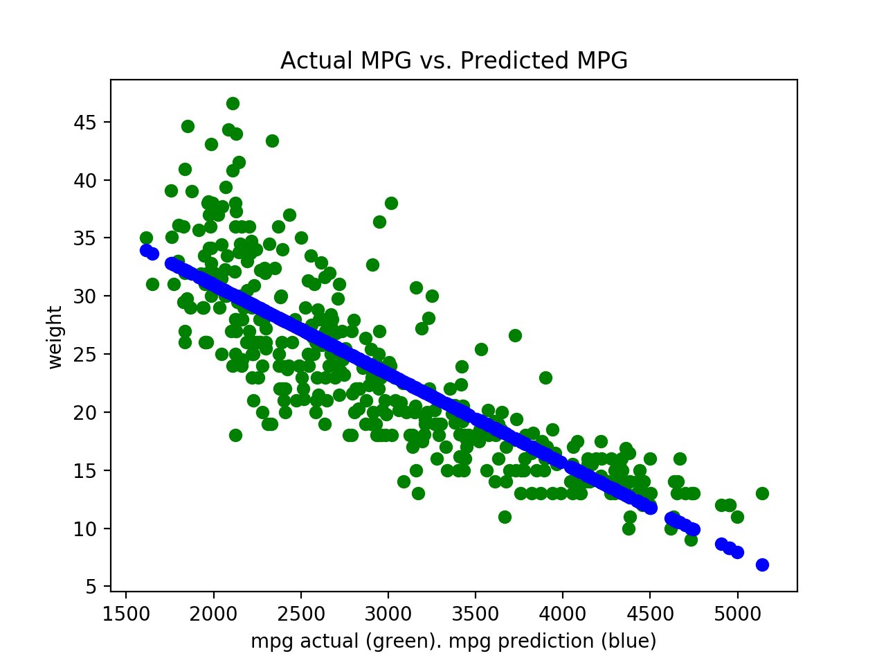

# auto-mpg-prediction
Analysis and Prediction of Auto MPG using Linear Regression

# Usage
`python predict_auto_mpg.py`

# Data
The file contains attributes of different cars including MPG
Sample of data looks like below

|mpg|  cylinders|  displacement| horsepower|  weight  |acceleration|  model year| origin |car name|
|---|-----------|--------------|-----------|----------|------------|------------|--------|--------|
|18.0|          8|         307.0|      130.0|  3504.0|          12.0|          70| 1  |chevrolet chevelle malibu  |
|15.0 |         8 |        350.0 |     165.0 | 3693.0 |         11.5 |         70 |  1 |         buick skylark 320|
|18.0  |        8  |       318.0  |    150.0  |3436.0  |        11.0  |        70  | 1  |       plymouth satellite|
|16.0   |       8   |      304.0   |   150.0  |3433.0   |       12.0   |       70   |1   |           amc rebel sst|
|17.0    |      8    |     302.0    |  140.0  |3449.0    |      10.5    |      70   |1    |            ford torino|

Data was downloaded from University of California Irvine https://archive.ics.uci.edu/ml/datasets/Auto+MPG

# Analysis
Looking at the image below. You will see the correlations with MPG

You can see that weight and displacement look to have a linear corrleation with MPG but weight looks more linear than displacement.
So I will use weight as the X to fit the linear regression model

Below is a plot of the actual MPG vs. the predicted MPG

# Model Error Metrics
Mean Squared Error (MSE) is **18.7809397346**. MSE is in mpg squared

Root Mean Squared Error (RMSE) is **4.33369815915**. RMSE is in in mpg